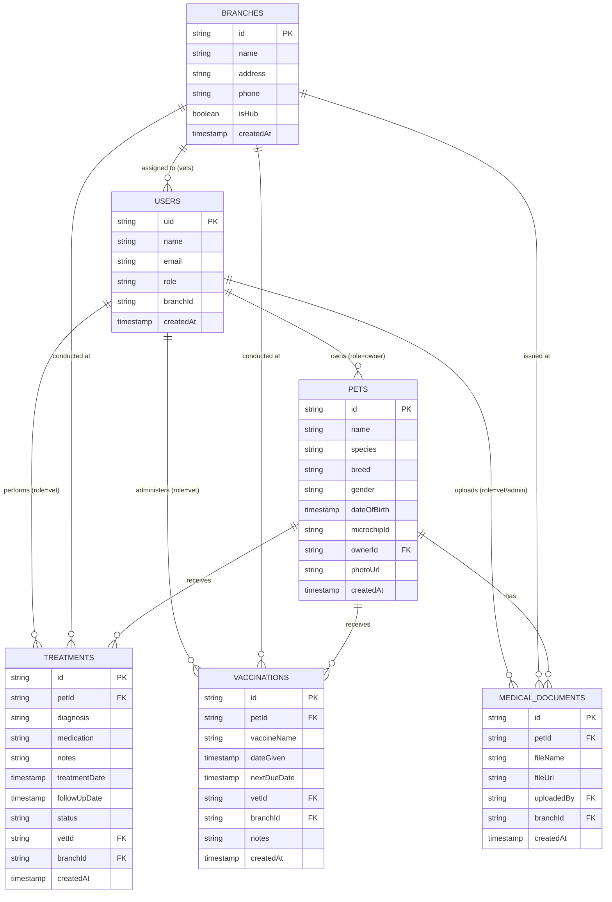

# VetCare Centralized Database Schema (Day 1)

This document specifies the exact Firestore database structure, field names, data types, and cross-branch conventions for the VetCare application. It serves as the single source of truth between the Database and Frontend/UI teams.

---

## Architecture Overview

VetCare is designed so that **a pet's medical records follow the pet across all clinic branches**. 
- Collections are organized at the **root level** to allow multi-branch indexing and queries.
- Records reference `branchId` (where the service occurred) and `vetId` (who performed it), enabling auditability while maintaining seamless cross-clinic pet history.

---

## Collections Specification

### 1. `users`
Stores profile data for pet owners, clinic veterinarians, and network administrators. Document ID is the Firebase Auth `uid`.

| Field Name | Firestore Type | Dart Type | Nullable | Description / UI Mapping |
| :--- | :--- | :--- | :--- | :--- |
| `name` | `string` | `String` | No | User's full display name |
| `email` | `string` | `String` | No | Login email address |
| `role` | `string` | `String` | No | Enum: `'owner'`, `'vet'`, `'admin'` |
| `branchId` | `string` | `String?` | **Yes** | Clinic branch where the vet works. Null for `'owner'` or global `'admin'`. |
| `createdAt` | `timestamp` | `DateTime` | No | Account registration timestamp (`FieldValue.serverTimestamp()`) |

#### Auth Provider Parity (Email/Password & Google Sign-In)
- **Unified Document Structure**: The `users` collection structure is **identical** regardless of whether the user authenticated via Email/Password or Google Sign-In (`google.com`).
- **UID as Single Source of Truth**: Document ID is strictly `request.auth.uid`. There is no auxiliary collection or separate schema branch (e.g., no `google_users` or conditional fields like `isGoogleUser`).
- **Security & Privilege Escalation Protection**:
  - `read`: Users can read only their own document (`request.auth.uid == userId`).
  - `update`: While users can update their profile information, they **cannot modify their `role` field** (`request.resource.data.role == resource.data.role`). This prevents client-side privilege escalation (e.g. an owner elevating themselves to admin or vet).

---

### 2. `pets`
Stores patient profiles. Medical history follows this entity regardless of which branch is visited.

| Field Name | Firestore Type | Dart Type | Nullable | Description / UI Mapping |
| :--- | :--- | :--- | :--- | :--- |
| `name` | `string` | `String` | No | Pet's name (e.g., "Milo") |
| `nameLower` | `string` | `String` | No | **[Indexed]** Lowercase name for prefix queries (`nameLower >= q && nameLower <= q + '\uf8ff'`) |
| `species` | `string` | `String` | No | Animal species (e.g., "Dog", "Cat", "Bird") |
| `breed` | `string` | `String` | No | Breed designation (e.g., "Golden Retriever") |
| `gender` | `string` | `String` | No | Enum: `'male'`, `'female'`, `'neutered_male'`, `'spayed_female'` |
| `dateOfBirth` | `timestamp` | `DateTime` | No | Used to display age (e.g., "3 Years Old") |
| `microchipId` | `string` | `String` | No | **[Updated]** Global ISO microchip / tag identifier for cross-branch lookup |
| `ownerId` | `string` | `String` | No | UID of the pet owner (`users/{uid}`) |
| `photoUrl` | `string` | `String?` | **Yes** | Cloud Storage download URL. Null falls back to default avatar icon |
| `weightKg` | `number` | `double?` | **Yes** | Patient weight in kilograms |
| `createdAt` | `timestamp` | `DateTime` | No | Timestamp of pet registration |

#### Cross-Branch Search & Query Architecture
1. **Case-Insensitive Prefix Search (`nameLower`)**:
   - Cloud Firestore does not support native substring or case-insensitive search.
   - Every pet document persists `nameLower: pet.name.toLowerCase()`.
   - Prefix queries execute as:
     `db.collection('pets').where('nameLower', isGreaterThanOrEqualTo: term.toLowerCase()).where('nameLower', isLessThanOrEqualTo: '${term.toLowerCase()}\uf8ff')`
2. **Owner-Based Patient Lookup**:
   - Query: `db.collection('pets').where('ownerId', isEqualTo: ownerUid).orderBy('createdAt', descending: true)`
3. **Client-Side Quick Filter Chips (Recommended Architecture)**:
   - The Vet Search Screen contains quick filter chips: **Dogs**, **Cats**, **Urgent Care**, **Due for Booster**.
   - **Recommendation**: Execute primary prefix retrieval on Firestore (`nameLower` or `microchipId`), then apply secondary chip filters **client-side in memory** on the returned result set.
   - *Why*: Creating Firestore composite indexes for every combination of `(species, urgentCare, dueForBooster, nameLower, createdAt)` causes severe index sprawl, increases write costs, and creates fragile index dependencies for auxiliary filters.

#### Record Edit/Delete Scoping Policy (Treatments & Vaccinations)
- **Policy**: **Strict Creator-Only (or Network Admin)**.
  - A veterinarian **cannot** edit or delete a clinical treatment or vaccination record authored by a colleague vet, even if both vets work at the identical clinic branch.
- **Justification**:
  1. *Medical & Legal Auditability*: Clinical notes, drug dosages, and vaccination signatures constitute personal medical records tied to a veterinarian's professional license. Allowing peers at the same branch to mutate historical consultation notes creates liability ambiguity and breaks tamper-evidence.
  2. *Addendum Pattern*: If a second vet at the same clinic assesses the patient during follow-up, they create a new treatment record with its own `diagnosis`, `medication`, and `followUpDate`, rather than altering the prior vet's entry.
  3. *Administrative Oversight*: If an accidental typo or bad record must be removed or amended, only a Network Administrator (`role: 'admin'`) or the original attending vet has deletion rights.

#### Pets Role-Based Permissions Matrix
| Action | Pet Owner (Own Pet) | Pet Owner (Other's Pet) | Veterinarian (`role: 'vet'`) | Network Admin (`role: 'admin'`) | Unregistered / No Role |
| :--- | :--- | :--- | :--- | :--- | :--- |
| **Read Profile** | ✅ Allowed | ❌ Denied | ✅ Allowed (Cross-branch) | ✅ Allowed | ❌ Denied |
| **Create Pet** | ✅ Allowed (ownerId matches) | ❌ Denied | ❌ Denied | ✅ Allowed | ❌ Denied |
| **Update Info** | ✅ Allowed (microchipId immutable) | ❌ Denied | ❌ Denied | ✅ Allowed (microchipId immutable) | ❌ Denied |
| **Modify Microchip** | ❌ Denied (Write-Once) | ❌ Denied | ❌ Denied | ❌ Denied (Write-Once) | ❌ Denied |
| **Delete Pet** | ✅ Allowed | ❌ Denied | ❌ Denied | ✅ Allowed | ❌ Denied |

---

### 3. `treatments`
Clinical consultation records, treatments, and scheduled follow-ups.

| Field Name | Firestore Type | Dart Type | Nullable | Description / UI Mapping |
| :--- | :--- | :--- | :--- | :--- |
| `petId` | `string` | `String` | No | Document ID of the patient pet |
| `diagnosis` | `string` | `String` | No | Chief complaint / clinical diagnosis |
| `medication` | `string` | `String` | No | Prescribed drugs, dosage, and frequency |
| `notes` | `string` | `String` | No | Attending vet's clinical observations |
| `treatmentDate` | `timestamp` | `DateTime` | No | Date and time consultation took place |
| `followUpDate` | `timestamp` | `DateTime?` | **Yes** | Scheduled next check-in (powers "Vet Follow-ups" screen). Null if none |
| `status` | `string` | `String` | No | Enum: `'active'`, `'resolved'`. Controls status badge in UI |
| `vetId` | `string` | `String` | No | Attending veterinarian's user ID |
| `branchId` | `string` | `String` | No | Branch where the consultation occurred |
| `createdAt` | `timestamp` | `DateTime` | No | Record creation timestamp (`FieldValue.serverTimestamp()`) |

#### Treatment Status Rule ('active' vs 'resolved')
- **Definition & Initial State**: Treatments are created with `status: 'active'` to indicate an ongoing diagnosis or course of treatment requiring monitoring.
- **Resolution Criteria**:
  1. **Manual Resolution**: An attending vet explicitly updates `status` to `'resolved'` upon completing treatment or during a follow-up discharge.
  2. **Automated Follow-Up Expiration**: A treatment is deemed functionally resolved if its `followUpDate` has passed and no newer treatment for the same pet marks the condition as active.
- **Security Constraints**:
  - `create`: Can only be created by an authenticated vet (`isVet()`). Target `petId` must exist in Firestore (`petExists()`).
  - `vetId` and `branchId` must strictly match the authenticated vet's own ID (`request.auth.uid`) and their clinic branch (`getUserData().branchId`), preventing spoofing.
  - `createdAt` must equal `request.time` (server timestamp).
  - `update` / `delete`: Allowed only by the creating vet (`vetId == auth.uid`) or an admin (`isAdmin()`). Core link keys (`petId`, `vetId`, `branchId`, `createdAt`) are immutable.

---

### 4. `vaccinations`
Immunization history and booster tracking.

| Field Name | Firestore Type | Dart Type | Nullable | Description / UI Mapping |
| :--- | :--- | :--- | :--- | :--- |
| `petId` | `string` | `String` | No | Document ID of the vaccinated pet |
| `vaccineName` | `string` | `String` | No | Vaccine title (e.g., "Rabies 3-Year", "DHPP Booster") |
| `dateGiven` | `timestamp` | `DateTime` | No | Date administered |
| `nextDueDate` | `timestamp` | `DateTime` | No | Expiration / booster due date |
| `vetId` | `string` | `String` | No | Attending veterinarian's user ID |
| `branchId` | `string` | `String` | No | Clinic branch where administered |
| `notes` | `string` | `String` | No | Batch / lot notes or adverse reaction remarks (can be empty string) |
| `createdAt` | `timestamp` | `DateTime` | No | Record creation timestamp (`FieldValue.serverTimestamp()`) |

#### Vaccination Validity Determination (Client-Side Computation)
- **Architectural Decision**: Validity statuses ("Up to date", "Due Soon", "Overdue", and "X Year Valid") are **computed dynamically client-side at render time** from `dateGiven` and `nextDueDate`, rather than stored as a static field in Firestore.
  - *Reasoning*: A stored field (e.g. `status: "valid"`) silently rots and becomes stale the moment calendar time crosses `nextDueDate`. Computing client-side against `DateTime.now()` guarantees 100% freshness, zero stale states, and zero background maintenance cron jobs.
- **Exact Computation Logic**:
  - **Overdue**: `nextDueDate.isBefore(DateTime.now())` (or `daysUntilDue < 0`).
  - **Due Soon**: `daysUntilDue >= 0 && daysUntilDue <= 30`.
  - **Up to date**: `daysUntilDue > 30`.
  - **Validity Duration**: `years = (nextDueDate.difference(dateGiven).inDays / 365).round()`. If `years >= 1` ➔ `"$years Year Valid"` (e.g. "3 Year Valid"); otherwise `"$months Month Valid"`.
- **Security Constraints**:
  - Creation restricted to authenticated vets (`isVet()`) for existing pets (`petExists()`).
  - Strict anti-spoofing: `vetId == request.auth.uid` and `branchId == getUserData().branchId`.
  - `createdAt == request.time`.
  - Only creating vet or admin can update or delete.

---

### 5. `branches`
Physical vet clinic locations in the network.

| Field Name | Firestore Type | Dart Type | Nullable | Description / UI Mapping |
| :--- | :--- | :--- | :--- | :--- |
| `name` | `string` | `String` | No | Branch title (e.g., "Central Vet Hospital - Downtown") |
| `address` | `string` | `String` | No | Street address and postal info |
| `phone` | `string` | `String` | No | Official contact number |
| `isHub` | `boolean` | `bool` | No | **[Updated]** `true` for central emergency/hub clinic, `false` for satellite clinics |
| `createdAt` | `timestamp` | `DateTime` | No | Registration timestamp |

---

### 6. `medical_documents`
Digital lab reports, radiograph (X-Ray) scans, prescriptions, and external records stored in Cloud Storage.

| Field Name | Firestore Type | Dart Type | Nullable | Description / UI Mapping |
| :--- | :--- | :--- | :--- | :--- |
| `petId` | `string` | `String` | No | Document ID of the pet |
| `fileName` | `string` | `String` | No | Display name (e.g., "Complete Blood Count Panel.pdf") |
| `fileUrl` | `string` | `String` | No | Download URL from Firebase Storage |
| `uploadedBy` | `string` | `String` | No | UID of user who uploaded the file |
| `branchId` | `string` | `String` | No | Clinic branch where document originated |
| `createdAt` | `timestamp` | `DateTime` | No | Timestamp of upload |

---

## Flagged Recommendations for Teammate Review

Before locking in the schema permanently, here are 4 high-value additions based on the current Flutter UI screens:

1. **Denormalized `vetName` & `branchName` in `treatments` & `vaccinations`**
   - *Reasoning:* The Flutter screens (`pet_profile_screen.dart`, `vaccinations_screen.dart`, `documents_screen.dart`) display human-readable strings like *"Clinic: Downtown Branch"* and *"Attending Veterinarian: Dr. John Doe"*. Without denormalization, the UI has to perform 2 extra asynchronous Firestore reads per item in a list just to show names. Storing `branchName` and `vetName` snapshots alongside `branchId` and `vetId` cuts Firestore reads and keeps list rendering snappy.
2. **`fileType` or `documentType` in `medical_documents`**
   - *Reasoning:* In `documents_screen.dart`, the UI differentiates icons between PDF reports (`Icons.picture_as_pdf`) and radiology scans (`Icons.image_outlined`). Adding an explicit field `documentType: 'lab_report' | 'xray' | 'prescription' | 'other'` or `mimeType: string` prevents brittle client-side file extension guessing.
3. **`phone` in `users` (especially for pet owners)**
   - *Reasoning:* In `vet_search_screen.dart`, the search prompt says: *"Search any registered pet by microchip ID, phone number, or tag across branches."* Having `phone` on `users` is essential for reception desk lookups when an owner arrives without remembering their microchip number.
4. **`createdAt` on `branches`**
   - *Reasoning:* Added `createdAt: timestamp` to `branches` for consistency with all other 5 collections.
